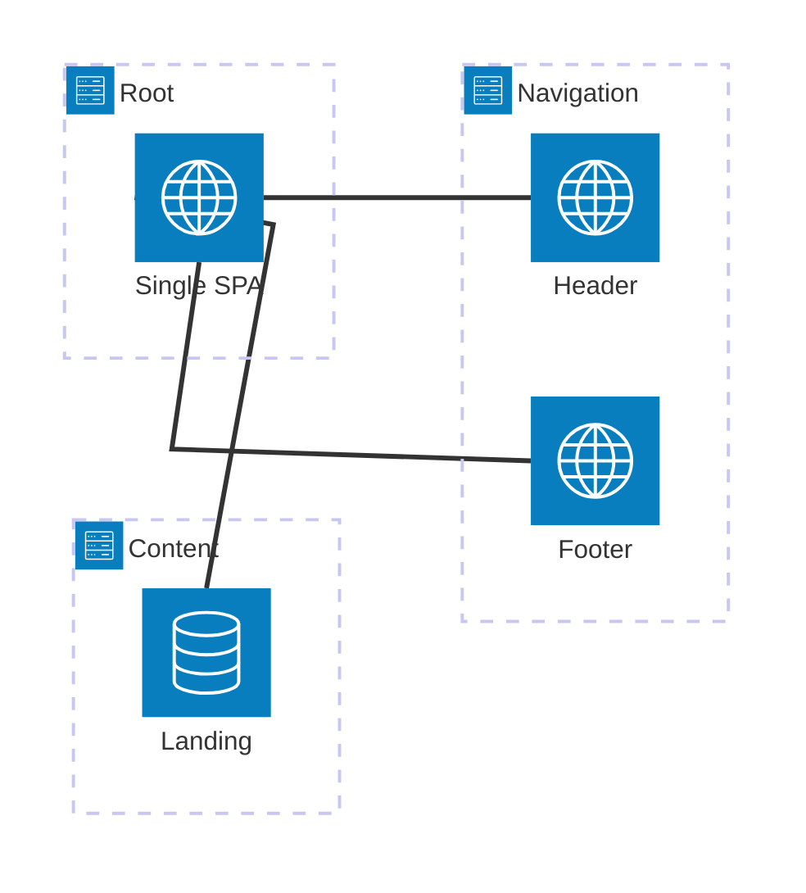

<picture>
  <source srcset="https://assets.vercel.com/image/upload/v1689795055/docs-assets/static/docs/microfrontends/mfe-banner-dark.png" media="(prefers-color-scheme: dark)">
  <source srcset="https://assets.vercel.com/image/upload/v1689795055/docs-assets/static/docs/microfrontends/mfe-banner-light.png" media="(prefers-color-scheme: light)">
  
</picture>

Using this example, you can learn how to set up a microfrontend using single-spa with Module Federation on Vercel. This example demonstrates how to create a microfrontend architecture that allows you to load multiple applications in a single page, enabling independent deployments and development.

The example is available on GitHub at [vercel-labs/microfrontends-single-spa-module-federation](https://github.com/vercel-labs/microfrontends-single-spa-module-federation).

## What You'll Learn

This example demonstrates real-world microfrontend patterns and best practices:

- **📊 Vercel Microfrontends**: Production-ready deployment on Vercel's platform
- **🔗 Module Federation**: Share code between applications at runtime using Webpack's Module Federation
- **🏗️ single-spa Integration**: Orchestrate microfrontends with single-spa's lifecycle management
- **⚡ Runtime Code Sharing**: Dynamically load and share components between applications
- **📦 Federated Components**: Expose and consume React components across application boundaries
- **🚀 Independent Deployments**: Deploy each microfrontend without affecting others
- **🎯 Team Autonomy**: Enable teams to work independently while sharing code seamlessly
- **🔧 Vite & Tailwind**: Modern build tools with utility-first CSS framework

## Understanding the Architecture

This example implements a hybrid architecture combining **single-spa** for application orchestration with **Module Federation** for runtime code sharing:

### Key Components

1. **Root Application (`apps/root/`)**

   - Acts as the shell application and single-spa orchestrator
   - Dynamically imports components from content and navigation remotes
   - Manages the overall application layout and routing with single-spa
   - Configures federated remotes and manages dependencies

2. **Content Application (`apps/content/`)**

   - Exposes content-related components through Module Federation
   - Provides federated page components wrapped with single-spa lifecycle
   - Maintains its own styling and component logic
   - Mounted as a single-spa application in the root

3. **Navigation Application (`apps/navigation/`)**

   - Exposes navigation components (header and footer) through Module Federation
   - Provides reusable navigation components for the entire application
   - Each component (header/footer) is registered as separate single-spa applications
   - Manages navigation state and user interactions

4. **Shared Packages (`packages/`)**
   - Common TypeScript configurations across all applications
   - Shared ESLint rules and formatting standards
   - Ensures consistency across all microfrontends

### Architecture Flow



This hybrid approach provides:

- **single-spa**: Application lifecycle management and routing orchestration
- **Module Federation**: Efficient runtime code sharing and dependency optimization
- **Best of both worlds**: Robust application management with optimized code sharing

## Getting Started

### Prerequisites

To run the example, you will need the following prerequisites:

- [Node.js](https://nodejs.org/) installed on your machine.
- [pnpm](https://pnpm.io/) package manager installed.
- [Git](https://git-scm.com/) installed to clone the repository.

It is also recommended to have:

- Familiarity with [single-spa](https://single-spa.js.org/) and [Module Federation](https://module-federation.io/) concepts.
- Basic understanding of [Vercel](https://vercel.com/) deployment process.
- A Vercel account to deploy the microfrontend applications.

### Local Development Setup

Follow these steps to set up the example on your local machine. Make sure you have the prerequisites installed before proceeding.

1. **Clone the repository:**

   ```sh
   git clone https://github.com/vercel-labs/microfrontends-single-spa-module-federation.git
   cd microfrontends-single-spa-module-federation
   ```

2. **Install dependencies:**

   ```sh
   pnpm install
   ```

3. **Start the development environment:**

   ```sh
   pnpm dev
   ```

   This command starts all applications simultaneously:

   - Root app
   - Content app
   - Navigation app

4. **Access the application:**

   Open [http://localhost:3024](http://localhost:3024) in your browser to see the federated application where components from different microfrontends are composed together using single-spa and Module Federation.

## Tech stack

This example uses the following technologies:

- **singla-spa**: A framework for building microfrontends that allows you to load multiple applications in a single page. Learn more about single-spa in the [single-spa documentation](https://single-spa.js.org/).
- **Module Federation**: A feature of Webpack that allows you to share code between multiple applications at runtime. It enables the microfrontend architecture by allowing applications to dynamically load each other. Learn more about Module Federation in the [Module Federation documentation](https://module-federation.io/).
- **Tailwind CSS**: A utility-first CSS framework that is used to style the microfrontend applications. Learn more about Tailwind CSS in the [Tailwind CSS documentation](https://tailwindcss.com/docs).
- **Vercel**: A platform for deploying and hosting web applications, which provides features for managing microfrontends. Learn more about Vercel in the [Vercel documentation](https://vercel.com/docs).
- **pnpm**: A fast and efficient package manager that is used to manage dependencies in this example. Learn more about pnpm in the [pnpm documentation](https://pnpm.io/).
- **Turborepo**: A high-performance build system that is used to manage the monorepo structure of the example. Learn more about Turborepo in the [Turborepo documentation](https://turborepo.org/docs).
- **Vite**: A fast build tool that is used to build the microfrontend applications. Learn more about Vite in the [Vite documentation](https://vitejs.dev/).

## Microfrontends configuration

The microfrontends are configured using the `microfrontends.json` file. This file defines the applications and their routing. The example uses the following configuration:

```jsonc
// apps/root/microfrontends.json
{
  "$schema": "https://openapi.vercel.sh/microfrontends.json",
  "applications": {
    "microfrontends-single-spa-module-federation-root": {
      "development": {
        "fallback": "microfrontends-single-spa-module-federation-root.vercel.app",
      },
    },
    "microfrontends-single-spa-module-federation-content": {
      "routing": [
        {
          "paths": ["/_content/:path*"],
        },
      ],
    },
    "microfrontends-single-spa-module-federation-navigation": {
      "routing": [
        {
          "paths": ["/_navigation/:path*"],
        },
      ],
    },
  },
}
```

This configuration is defined in the root application, which is the default application of the microfrontends group. The `microfrontends.json` file specifies the applications and their routing paths. The `development.fallback` field is used to specify a fallback URL. See more details on how to manage your microfrontends in the [Managing Microfrontends](https://vercel.com/docs/microfrontends/managing-microfrontends) documentation.

The `microfrontends.json` in this example defines three applications:

- `microfrontends-single-spa-module-federation-root`: The root application that serves as the entry point for the microfrontend architecture. This is the default application of the Microfrontends group.
- `microfrontends-single-spa-module-federation-content`: A microfrontend application that handles content-related functionality. It is routed to paths starting with `/_content/`. The application will provide the landing page content for our example.
- `microfrontends-single-spa-module-federation-navigation`: A microfrontend application that handles navigation functionality. It is routed to paths starting with `/_navigation/`. The application will provide the navigation components.

As we don't specify a specific local Microfrontends proxy port, the local Microfrontends proxy will run on port `3024` by default. You can change this by setting `localProxyPort` in the `microfrontends.json` file.

## Vite configuration

To make Microfrontends and Module Federation work, we need to configure Vite in each microfrontend application.

For the `navigation` and `content` applications providing the Module Federation remotes for the root application, we need to set up the Vite configuration as follows:

```ts {11,15,19-20} filename="apps/navigation/vite.config.ts"
import { defineConfig, type Plugin } from 'vite';
import { federation } from '@module-federation/vite';
import tailwindcss from '@tailwindcss/vite';
import { microfrontends } from '@vercel/microfrontends/experimental/vite';
import react from '@vitejs/plugin-react';

export default defineConfig({
  plugins: [
    tailwindcss(),
    microfrontends({
      basePath: '/_navigation',
    }) as Plugin,
    react(),
    federation({
      name: 'navigation',
      manifest: true,
      filename: 'remoteEntry.js',
      exposes: {
        './header': './src/header/index.tsx',
        './footer': './src/footer/index.tsx',
      },
      shared: {
        react: {
          singleton: true,
        },
        'react/': {
          singleton: true,
        },
        'react-dom': {
          singleton: true,
        },
        'react-dom/': {
          singleton: true,
        },
      },
    }) as Plugin[],
  ],
  build: {
    target: 'chrome89',
  },
});
```

The only difference between the `navigation` and `content` applications is the `basePath` in the `microfrontends` plugin configuration, the name of the Module Federation remote and the exposed modules. The `basePath` is set to `/_navigation` for the `navigation` application and to `/_content` for the `content` application.

```ts {11,15,19} filename="apps/content/vite.config.ts"
import { defineConfig, type Plugin } from 'vite';
import { federation } from '@module-federation/vite';
import tailwindcss from '@tailwindcss/vite';
import { microfrontends } from '@vercel/microfrontends/experimental/vite';
import react from '@vitejs/plugin-react';

export default defineConfig({
  plugins: [
    tailwindcss(),
    microfrontends({
      basePath: '/_content',
    }) as Plugin,
    react(),
    federation({
      name: 'content',
      manifest: true,
      filename: 'remoteEntry.js',
      exposes: {
        './landing': './src/landing.tsx',
      },
      shared: {
        react: {
          singleton: true,
        },
        'react/': {
          singleton: true,
        },
        'react-dom': {
          singleton: true,
        },
        'react-dom/': {
          singleton: true,
        },
      },
    }) as Plugin[],
  ],
  build: {
    target: 'chrome89',
  },
});
```

Both configurations use the `@module-federation/vite` plugin to set up Module Federation and the `@vercel/microfrontends/experimental/vite` plugin to enable microfrontends support. The `federation` plugin is used to expose the components of the microfrontend applications, while the `microfrontends` plugin is used to configure the base path for the microfrontend routing.

For both the `navigation` and `content` applications, we expose the components that will be used by the root application. The `navigation` application exposes a header and footer component, while the `content` application exposes a landing component.

React and React DOM are shared as singletons to ensure that the same instance is used across the microfrontends. This is important for maintaining a consistent state and avoiding issues with multiple instances of React.

The additional specification for a `build.target` is set to `chrome89` to ensure compatibility with the features used in the microfrontends. In this case we need top-level await support, which is available in Chrome 89 and later.

For the root application, we need to set up the Vite configuration to load the microfrontends and use the exposed components from the `navigation` and `content` applications:

```ts {17-28} filename="apps/root/vite.config.ts"
import { defineConfig, type Plugin } from 'vite';
import { federation } from '@module-federation/vite';
import tailwindcss from '@tailwindcss/vite';
import { microfrontends } from '@vercel/microfrontends/experimental/vite';
import { vercelToolbar } from '@vercel/toolbar/plugins/vite';
import react from '@vitejs/plugin-react';

export default defineConfig({
  plugins: [
    tailwindcss(),
    microfrontends() as Plugin,
    vercelToolbar(),
    react(),
    federation({
      name: 'root',
      manifest: true,
      remotes: {
        navigation: {
          type: 'module',
          name: 'navigation',
          entry: '/_navigation/remoteEntry.js',
        },
        content: {
          type: 'module',
          name: 'content',
          entry: '/_content/remoteEntry.js',
        },
      },
      shared: {
        react: {
          singleton: true,
        },
        'react/': {
          singleton: true,
        },
        'react-dom': {
          singleton: true,
        },
        'react-dom/': {
          singleton: true,
        },
      },
    }) as Plugin[],
  ],
  build: {
    target: 'chrome89',
  },
});
```

The root application doesn't expose any components, but it loads the `navigation` and `content` applications as remotes using Module Federation. The `remotes` configuration specifies the entry points for the remote applications, which are the `remoteEntry.js` files exposed by the `navigation` and `content` applications.

As we are using Vite for the `navigation` and `content` applications providing the Module Federation remotes, we use remotes specified with `type: 'module'` to load the remote applications. This allows us to use the native ES module loading capabilities of the browser, which is supported by Vite.

The entry paths for the remotes are set to `/_navigation/remoteEntry.js` and `/_content/remoteEntry.js`, which correspond to the base paths defined in the `microfrontends.json` file. As we are using Vercel Microfrontends solution and in this example we are using client-side rendering, we can use relative URLs for the remotes. This allows the root application to dynamically load the components from the `navigation` and `content` applications at runtime. The routing will be managed by Vercel Microfrontends, which will ensure that the correct application is loaded based on the path.

## Root application

The root application is the entry point for the microfrontend architecture. It is responsible for loading the `navigation` and `content` remotes and rendering their components as single-spa applications.

To create a layout for the root application using single-spa, we can use the following HTML structure:

```html {11-13} filename="apps/root/index.html"
<!doctype html>
<html lang="en">
  <head>
    <meta charset="UTF-8" />
    <meta name="viewport" content="width=device-width, initial-scale=1.0" />
    <title>Company Landing Page</title>
    <link rel="stylesheet" href="./src/globals.css" />
    <script type="module" src="./src/index.ts"></script>
  </head>
  <body className="flex min-h-screen flex-col">
    <div id="single-spa-application:header"></div>
    <div id="single-spa-application:content"></div>
    <div id="single-spa-application:footer"></div>
  </body>
</html>
```

To register each application with single-spa, we can use the following code in the `src/index.ts` file of the root application:

```ts {7,13,19} filename="apps/root/src/index.ts"
import { mountVercelToolbar } from '@vercel/toolbar/vite';
import { registerApplication, start } from 'single-spa';
import './globals.css';

registerApplication(
  'header',
  () => import('navigation/header'),
  () => true,
);

registerApplication(
  'footer',
  () => import('navigation/footer'),
  () => true,
);

registerApplication(
  'content',
  () => import('content/landing'),
  () => true,
);

start();
mountVercelToolbar();
```

We register each single-spa application using the `registerApplication` function. Each application is registered with a name, a loading function that imports the remote component using dynamic ES module import, and an activity function that determines when the application should be active based on the current route, which will be always true in the case of this example.

## Remote applications

In the remote applications, we are using `single-spa-react` to create a React component that will be rendered by single-spa. The `content` application provides the main page content, while the `navigation` application provides the header and footer components.

We need to define the `bootstrap`, `mount`, and `unmount` functions for each component. These functions are used by single-spa to manage the lifecycle of the applications.

```tsx {13} filename="apps/content/src/index.tsx"
import React from 'react';
import ReactDOMClient from 'react-dom/client';
import singleSpaReact from 'single-spa-react';
import './globals.css';

function Landing(): React.JSX.Element {
  return <>{/* ... */}</>;
}

export const { bootstrap, mount, unmount } = singleSpaReact({
  React,
  ReactDOMClient,
  rootComponent: Landing,
  errorBoundary() {
    return <></>;
  },
});
```

For the `navigation` application, we define the header and footer components similarly.

```tsx {5} filename="apps/navigation/src/header/index.tsx"
// ...
export const { bootstrap, mount, unmount } = singleSpaReact({
  React,
  ReactDOMClient,
  rootComponent: Header,
  errorBoundary() {
    return <></>;
  },
});
```

```tsx {5} filename="apps/navigation/src/footer/index.tsx"
// ...
export const { bootstrap, mount, unmount } = singleSpaReact({
  React,
  ReactDOMClient,
  rootComponent: Footer,
  errorBoundary() {
    return <></>;
  },
});
```

The difference being which `rootComponent` is used for each application. The `Landing` component in the `content` application, and the `Header` and `Footer` components in the `navigation` application.

## Local development

With everything needed set up, you can now run the microfrontend applications locally. The root application will be available at `http://localhost:3024`, and it will load the `content` and `navigation` applications as microfrontends.

To start a development server for each application, we use a `dev` npm script in each application's `package.json` file. The `dev` script uses Vite to start the development server for the application and also specifies the port to run on when using the Microfrontends proxy.

```jsonc
// apps/root/package.json
{
  "scripts": {
    "build": "vite build",
    "dev": "vite --port $(microfrontends port)",
    "start": "vite preview --port $(microfrontends port)",
  },
}
```

Run the following command in the root directory of the cloned repository to start the development server and the Microfrontends proxy:

```sh
pnpm dev
```

This command will start all the applications in the monorepo and also starts the Microfrontends proxy on port `3024`.

## 🚀 Deploy to Vercel

Deploy each microfrontend independently to experience the full power of distributed development:

| Application | Description                                                           | Deploy                                                                                                                                                                                                                                                                                                                                               |
| ----------- | --------------------------------------------------------------------- | ---------------------------------------------------------------------------------------------------------------------------------------------------------------------------------------------------------------------------------------------------------------------------------------------------------------------------------------------------- |
| Root        | Main shell application orchestrating single-spa and Module Federation | [](https://vercel.com/new/clone?repository-url=https://github.com/vercel-labs/microfrontends-single-spa-module-federation&project-name=microfrontends-single-spa-module-federation-root&repository-name=microfrontends-single-spa-module-federation-root&root-directory=apps/root)                   |
| Content     | Content microfrontend exposing landing page components                | [](https://vercel.com/new/clone?repository-url=https://github.com/vercel-labs/microfrontends-single-spa-module-federation&project-name=microfrontends-single-spa-module-federation-content&repository-name=microfrontends-single-spa-module-federation-content&root-directory=apps/content)          |
| Navigation  | Navigation microfrontend exposing header and footer                   | [](https://vercel.com/new/clone?repository-url=https://github.com/vercel-labs/microfrontends-single-spa-module-federation&project-name=microfrontends-single-spa-module-federation-navigation&repository-name=microfrontends-single-spa-module-federation-navigation&root-directory=apps/navigation) |

## Deployment Strategy

### Independent Deployment Benefits

Each microfrontend can be deployed independently, enabling:

- **Faster deployments**: Only the changed microfrontend needs redeployment
- **Reduced risk**: Deployments are isolated and can't break other parts
- **Team autonomy**: Teams can deploy on their own schedule
- **Rollback flexibility**: Roll back individual microfrontends without affecting others

### Step-by-Step Deployment Guide

1. **Fork the repository**: Create your own copy of the repository on GitHub.

2. **Set up Vercel projects**: Create separate Vercel projects for each microfrontend:

   - Fork this repository to your GitHub account
   - In Vercel, create a new project for each application (`root`, `content`, `navigation`)
   - Connect each project to your forked repository
   - Set the root directory for each project (`apps/root`, `apps/content`, `apps/navigation`)

3. **Configure Microfrontends group**:

   - In the Vercel dashboard, create a new Microfrontends group
   - Add all three applications to the group
   - Set the root application as the default application

4. **Environment configuration**:

   - Ensure each application has the correct build settings
   - Verify that the `microfrontends.json` file is properly configured
   - Set up any required environment variables

5. **Deploy and verify**:
   - Deploy each application independently
   - Test the integration by accessing the root application URL
   - Verify that all microfrontends load correctly and communicate properly

### Vercel Configuration

Each application includes optimized Vercel configuration:

- **Framework detection**: Automatic Vite optimization
- **Build settings**: Turborepo-aware build commands with Module Federation support
- **Environment variables**: Proper environment isolation for each microfrontend
- **Edge functions**: Optimal performance at the edge with Vercel's global CDN

### Production URLs

Once deployed, your applications will be accessible at URLs similar to:

- Root: `https://your-root-app.vercel.app`
- Content: `https://your-content-app.vercel.app`
- Navigation: `https://your-navigation-app.vercel.app`

The root application will automatically load the content and navigation microfrontends based on the routing configuration in `microfrontends.json`.

The example is deployed to Vercel at [https://vercel-microfrontends-single-spa.vercel.app](https://vercel-microfrontends-single-spa.vercel.app) already for you to check out.

## Development Workflow

### Working with Individual Microfrontends

You can develop microfrontends in isolation:

```sh
# Work on the root application only
cd apps/root
pnpm dev

# Work on the content application only
cd apps/content
pnpm dev

# Work on the navigation application only
cd apps/navigation
pnpm dev
```

### Building and Testing

```sh
# Build all applications
pnpm build

# Run linting across all apps
pnpm lint

# Type check all applications
pnpm typecheck

# Run all quality checks
pnpm checks
```

### Adding New Federated Components

1. Create the component in your remote application
2. Expose it through Module Federation in `vite.config.ts`:
   ```ts
   exposes: {
     './newComponent': './src/path/to/component.tsx'
   }
   ```
3. Add TypeScript declarations in the container app's `global.d.ts`:
   ```ts
   declare module 'remoteName/newComponent' {
     const Component: React.ComponentType;
     export default Component;
   }
   ```
4. Import and use in the container application:
   ```ts
   import NewComponent from 'remoteName/newComponent';
   ```

## Best Practices Implemented

### 🎯 Consistent Development Experience

- Shared TypeScript configuration ensures type safety across all federated modules
- Common ESLint rules maintain code quality standards
- Unified Prettier configuration for consistent formatting

### 🔧 Build Optimization

- Turborepo orchestrates builds efficiently with caching
- Module Federation optimizes shared dependencies automatically
- Independent builds enable faster CI/CD pipelines

### 🎨 UI Consistency

- Shared component patterns across federated modules
- Consistent design tokens and styling approach with Tailwind CSS
- Federated components maintain design system compliance

### 🚀 Performance Optimization

- Code splitting at the microfrontend level with Module Federation
- Shared chunk optimization for common dependencies (React, React DOM)
- Runtime loading optimization for federated modules
- Top-level await support for modern browser features

## Troubleshooting

### Common Issues and Solutions

**Module Federation loading errors:**

```sh
# Ensure all applications are running
pnpm dev
```

**TypeScript errors with federated modules:**

```sh
# Verify TypeScript declarations in global.d.ts
# Ensure module names match the federation configuration
```

**Build failures:**

```sh
# Run type checking to identify issues
pnpm typecheck

# Verify all federated modules are built correctly
pnpm build
```

## Single-spa vs Module Federation Comparison

This example combines both single-spa and Module Federation for optimal microfrontend architecture:

| Feature              | single-spa          | Module Federation    | Combined Approach                |
| -------------------- | ------------------- | -------------------- | -------------------------------- |
| Component Sharing    | URL-based routing   | Runtime code sharing | Both runtime sharing and routing |
| Bundle Size          | Independent bundles | Shared dependencies  | Optimized shared dependencies    |
| Integration          | Application-level   | Component-level      | Multi-level integration          |
| Lifecycle Management | Built-in lifecycle  | Manual lifecycle     | single-spa manages MF components |
| Use Case             | App orchestration   | Code sharing         | Complete microfrontend solution  |

**Benefits of the combined approach:**

- single-spa handles application lifecycle and routing
- Module Federation enables efficient code sharing and dependency management
- Best of both worlds: robust orchestration with optimized runtime sharing

## Architecture Benefits

### Team Autonomy

- **Independent development**: Teams can work on separate microfrontends without coordination
- **Technology flexibility**: Each microfrontend can use different versions of dependencies
- **Deployment independence**: Deploy changes without affecting other teams

### Scalability

- **Horizontal scaling**: Add new microfrontends without modifying existing ones
- **Performance isolation**: Poor performance in one microfrontend doesn't affect others
- **Code organization**: Clear separation of concerns across team boundaries

### Maintainability

- **Isolated testing**: Test each microfrontend independently
- **Gradual migrations**: Update or rewrite microfrontends incrementally
- **Clear ownership**: Each team owns their microfrontend completely

## Toolbar

The Vercel Toolbar is included in the root application to provide insights and debugging capabilities for the microfrontend applications. The toolbar can be mounted using the `mountVercelToolbar` function from the `@vercel/toolbar/vite` package.

Learn more about the Vercel Toolbar in the [Vercel Toolbar documentation](https://vercel.com/docs/vercel-toolbar).

## Conclusion

This example demonstrates how to set up a microfrontend architecture using single-spa with Module Federation on Vercel. By following the steps outlined in this guide and the provided repo on GitHub, you can create a scalable and maintainable microfrontend application that allows for independent deployments and development.

📚 [Documentation](https://vercel.com/docs/microfrontends)
